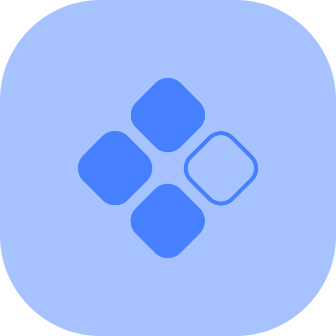

<!-- PROJECT LOGO -->
<br />
<h6 align="center">Carmen Seesink IDV 302</h6>
<p align="center">
</br>
   
  <a href="https://github.com/CarmenSeesink/CommuNeedy ">
    
  </a>
  
  <h3 align="center">CommuNeedy</h3>

  <p align="center">
    Connecting the community in need
  </p>


<!-- TABLE OF CONTENTS -->
## Table of Contents

* [Project Description](#project-description)
  * [Built with](#built-with)
* [Getting Started](#getting-started)
  * [Prerequisites](#prerequisites)
  * [How to install](#how-to-install)
* [Features and Functionality](#features-and-functionality)
   * [Post a need](#post-a-need)
   * [Make a donation](#make-a-donation)
   * [User authentication](#user-authentication)
   * [Create a profile](#create-a-profile))
* [Contributing](#contributing)
* [License](#license)
* [Acknowledgements](#acknowledgements)


<!--PROJECT DESCRIPTION-->
## Project Description

![image1][image1]

The current COVID-19 pandemic has left members in our community in need. These members are feeling hopeless as they have no means to provide for their basic needs such as food, water, hygiene and transportation.

At the same time there are privileged members that want to donate money to uplift these communities. Unfortunately, there is a gap in communication between these opposing communities.  

CommuNeedy is a web-application developed to mediate the connection between these communities. CommuNeedy provides a platform for users to either post their needs or donate. 

### Built With

* [Microsoft .NET](https://dotnet.microsoft.com/apps/aspnet)

<!-- GETTING STARTED -->
## Getting Started

These instructions will get you a copy of the project up and running on your local machine for development and testing purposes.

### Prerequisites

For development, the latest version of Visual Studio is required. The latest version can be downloaded from 

### How to install
 
1. Clone the repo
```sh
git clone https:://github.com/CarmenSeesink/CommuNeedy.git
```
2. Open the project

Use `Open Workspace` in Visual Studio.

<!-- FEATURES AND FUNCTIONALITY-->
## Features and Functionality

![image2][image2]

### Post a need

Cry out for help by posting your needs.

### Make a donation

Make a difference by donating to the community in need.

### User authentication

Ensure that your data remains secure.

### Create a profile

Create a profile with a manifesto so other users can get to know you.

![image3][image3] 

<!-- CONTRIBUTING -->
## Contributing

Contributions are what make the open source community such an amazing place to be learn, inspire, and create. Any contributions you make are **greatly appreciated**.

1. Fork the Project
2. Create your Feature Branch (`git checkout -b feature/AmazingFeature`)
3. Commit your Changes (`git commit -m 'Add some AmazingFeature'`)
4. Push to the Branch (`git push origin feature/AmazingFeature`)
5. Open a Pull Request

<!-- AUTHORS -->
## Authors

* **Carmen Seesink** - [CarmenSeesink](https://github.com/CarmenSeesink)

<!-- LICENSE -->
## License

Distributed under the MIT License. See `LICENSE` for more information.

<!-- ACKNOWLEDGEMENTS -->
## Acknowledgements

* [ASP.NET tutorial for beginners](https://docs.microsoft.com/en-us/aspnet/core/tutorials/first-mvc-app/start-mvc?view=aspnetcore-3.1&tabs=visual-studio)

<!-- MARKDOWN LINKS & IMAGES -->
[image1]: Images/1.png
[image2]: Images/2.png
[image3]: Images/3.png

